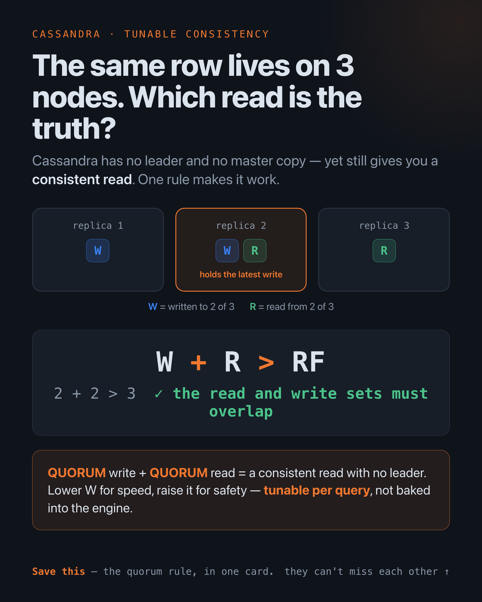

# Cassandra Data Modeling Lab

**🇧🇷 Português** · [🇬🇧 English](README.md)

Um laboratório prático para a parte do Cassandra que derruba quem vem do SQL:
você não modela os dados e depois consulta — você modela os dados **em torno da
query**. Sem joins, sem `WHERE` ad-hoc, desnormalizando de propósito. Entenda
essa única virada de chave e o resto do Cassandra (o storage engine, os botões
de consistência) se encaixa.

Cada conceito aqui é um arquivo executável contra um nó real do Cassandra 5.0 no
Docker. O schema é CQL que você lê de cima a baixo; os exemplos são scripts
Python pequenos que provam uma ideia cada e verificam o resultado.

## A virada de chave, em uma linha

Um schema relacional é normalizado em torno de *entidades* e reconstruído com
join na hora da query. Um schema Cassandra é desnormalizado em torno de
*queries* — uma tabela por padrão de acesso, o mesmo dado duplicado em cada
formato que uma leitura precisa. Não existe join pra remontar depois, então você
decide o formato antes.

## O que tem aqui

| Conceito | A ideia central | Arquivo |
|--------|-----------------|---------|
| **Keyspace e replicação** | O replication factor (RF) é definido por keyspace — quantas cópias de cada linha existem. | [`schema/01_keyspace.cql`](schema/01_keyspace.cql) |
| **Modelagem query-first** | Uma tabela por query. O mesmo pedido guardado de duas formas pra que duas buscas sejam um seek cada. | [`schema/02_query_first.cql`](schema/02_query_first.cql) |
| **Partition e clustering key** | `PRIMARY KEY ((partition), clustering)` — a partition escolhe o *nó*, a clustering escolhe a *ordenação dentro dele*. | [`examples/04_partition_and_clustering.py`](examples/04_partition_and_clustering.py) |
| **Bucketing de time-series** | Bucketize a partition key por tempo pra que uma partição não cresça pra sempre. | [`schema/03_timeseries.cql`](schema/03_timeseries.cql) |
| **Escrita idempotente** | `INSERT` é upsert; a mesma chave sobrescreve, nunca duplica. Reprocessamento seguro de graça. | [`examples/02_idempotent_writes.py`](examples/02_idempotent_writes.py) |
| **Tunable consistency** | Consistência por query; `W + R > RF` garante uma leitura consistente sem líder. | [`examples/03_consistency_levels.py`](examples/03_consistency_levels.py) |
| **Lightweight transactions** | Compare-and-set via Paxos (`IF NOT EXISTS`) — correto, mas caro; use com parcimônia. | [`examples/05_lightweight_transactions.py`](examples/05_lightweight_transactions.py) |
| **Anti-padrões** | Partições gigantes, `ALLOW FILTERING`, secondary index mal usado, acúmulo de tombstones. | [`schema/99_antipatterns.cql`](schema/99_antipatterns.cql) |

<p align="center">
   RF, os dois conjuntos sempre se sobrepõem em pelo menos um nó que tem a escrita mais recente.">
  <br><em>A consistência ajustável num relance — por que W + R &gt; RF dá uma leitura consistente sem líder (<a href="examples/03_consistency_levels.py">03_consistency_levels.py</a>).</em>
</p>

## Por que a escrita é barata e a leitura exige boa modelagem

O Cassandra guarda dados numa **LSM tree**: uma escrita anexa ao commit log e a
uma memtable em memória, e retorna — só isso. Quando a memtable enche, é
despejada em disco como uma **SSTable imutável**. Como SSTables nunca mudam, um
`UPDATE` só escreve uma versão com timestamp mais novo e um `DELETE` escreve um
**tombstone**; a **compaction** em segundo plano depois junta as SSTables, mantém
a versão mais nova (last-write-wins) e descarta os tombstones vencidos. Por isso
a escrita é append-only e rápida, mas uma leitura pode ter que reconciliar
várias SSTables — que é exatamente por que o design de partition/clustering
importa tanto.

## Como rodar

Requisitos: Docker, Python 3.9+ e `make`.

```bash
pip install -r requirements.txt

make schema     # sobe o Cassandra, espera ficar pronto, carrega keyspace + tabelas
make examples   # roda os cinco exemplos Python em ordem
make cqlsh      # opcional: um shell CQL interativo
make down       # para e remove o cluster
```

Duas coisas que vale saber, ambas aprendidas no osso montando este lab:

- **Cassandra é faminto por memória.** O `docker-compose.yml` limita o heap da
  JVM a 512M pra caber num laptop; dê ao Docker pelo menos ~2 GB ou o container é
  morto por OOM (exit 137) já no primeiro boot. O primeiro boot leva ~60–90s.
- **Comando do compose.** O `Makefile` chama o binário `docker-compose` (v1). Se
  o seu é a forma de plugin, rode `make COMPOSE="docker compose" schema`.

## Nó único vs. produção

Este lab é **um nó com RF=1**, então todo consistency level resolve para esse nó
— você vê a API e a aritmética, não a garantia de múltiplos nós. Num cluster real
você usaria `NetworkTopologyStrategy` com RF=3, onde `QUORUM`=2, e uma escrita
`QUORUM` + leitura `QUORUM` (2 + 2 > 3) é o que de fato garante uma leitura
consistente sem líder. Em setups multi-datacenter a escolha do dia a dia é
`LOCAL_QUORUM`: consistência forte no DC local sem esperar outro continente.

## Onde isso se encaixa

O Cassandra é a camada de serving — escrita rápida, leitura por chave, sem joins
nem agregação cross-partition. A analítica pesada roda em outro lugar: um job
Spark lê o Cassandra por token range e faz os group-bys e rollups. E a
propriedade de upsert idempotente daqui é a mesma segurança de reprocessamento
que você quer de um `MERGE` incremental num pipeline Spark — os dois sistemas se
encontram em "rodar o batch de novo não muda nada".
